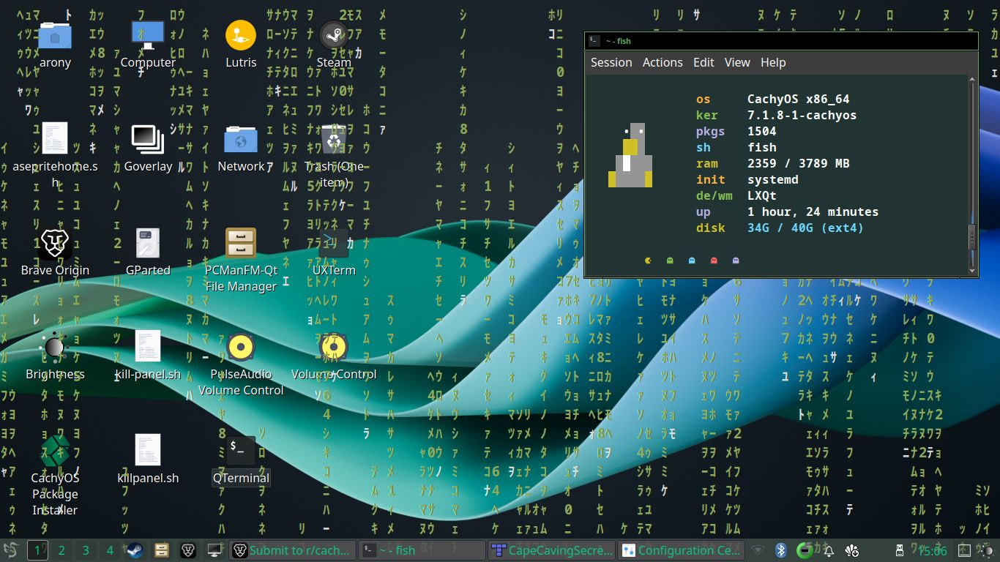

# Matrix Rain Overlay

A fullscreen, click-through Matrix-style digital rain effect for your Linux
desktop — real Unicode katakana, transparent background, and mouse clicks
pass straight through to whatever's underneath. Your own windows can still
be brought above it (e.g. via "Always on Top" in your window manager).




## Requirements

- Linux with an **X11** session (Xorg, or Xwayland — not pure Wayland; the
  overlay relies on X11/EWMH window tricks that Wayland compositors don't
  expose to clients)
- [`alacritty`](https://alacritty.org/) terminal emulator
- [`picom`](https://github.com/yshui/picom) compositor (for transparency)
- Python 3 with [`python-xlib`](https://github.com/python-xlib/python-xlib)
  (`pip install --user python-xlib`, or your distro's `python3-xlib` package)

Tested on LXQt + Openbox + picom. Should work on any X11 WM that follows
EWMH (`_NET_WM_STATE`, `_NET_WM_DESKTOP`, `_NET_CLIENT_LIST`) — i.e. most
of them (Openbox, i3, XFCE, KDE/X11, etc).

## Install

```bash
git clone https://github.com/aronyoddity/matrix-rain-overlay.git
cd matrix-rain-overlay
./install.sh
```

The installer checks for missing dependencies and tells you what to install
if anything's missing. It puts scripts in `~/.local/bin`, config in
`~/.config/cmatrix-overlay`, and adds a desktop launcher icon.

## Use

- Double-click the **Matrix Rain** icon on your desktop, or in your
  applications menu, or:
- `cmatrix-overlay` — start (returns immediately, runs in background)
- `cmatrix-overlay-stop` — stop
- `cmatrix-overlay-stop --all` — stop and also kill picom

## Uninstall

```bash
./uninstall.sh
```

## Resource usage

Lightweight — roughly 90–100 MB RAM total (alacritty + the rain script +
picom) and a few percent of one CPU core, safe to leave running all day.

## How it works / design notes

- **Real katakana, not cmatrix's `-c` flag**: cmatrix's built-in "Japanese
  characters" mode emits legacy high bytes meant for an old X11 bitmap font
  (`mtx.pcf`), which render as blank space in any modern UTF-8 terminal.
  `bin/matrix-rain.py` is a small custom `curses` script that draws real
  half-width katakana (U+FF66–U+FF9D) plus digits instead.
- **Click-through**: the X SHAPE extension, setting the window's *input*
  shape (not bounding shape) to an empty region. The window still renders
  normally; X just never routes pointer events to it.
- **Layering**: the overlay deliberately does *not* request
  `_NET_WM_STATE_ABOVE` and is never re-raised after launch, so it sits in
  the normal stacking layer — any window you click/focus naturally ends up
  above it and stays there. This is what makes "Always on Top" on your own
  windows actually work.
- **Fullscreen + all-desktops**: raw EWMH client messages
  (`_NET_WM_DESKTOP` = all desktops, `_NET_WM_STATE_STICKY`/
  `SKIP_TASKBAR`/`SKIP_PAGER`), plus clearing alacritty's resize-increment
  hints so the WM will actually let it fill the whole screen.
- Config lives in `config/alacritty.toml` (`opacity = 0.0` — fully
  transparent background, only the falling characters are visible; raise
  this if you want a dark tint instead) and `config/picom.conf`.

## Ideas for extending this

- CLI flags on `matrix-rain.py` for color/speed/density instead of
  hardcoded values.
- A rainbow/multi-color mode.
- A toggle keybinding instead of separate start/stop commands.
- "Wake up..." Easter egg messages typed out like the movie's intro.
- A user-editable settings file instead of editing the Python script.
- Multi-monitor awareness (currently sizes to the primary screen at
  launch).

## License

MIT — do whatever you want with it.
